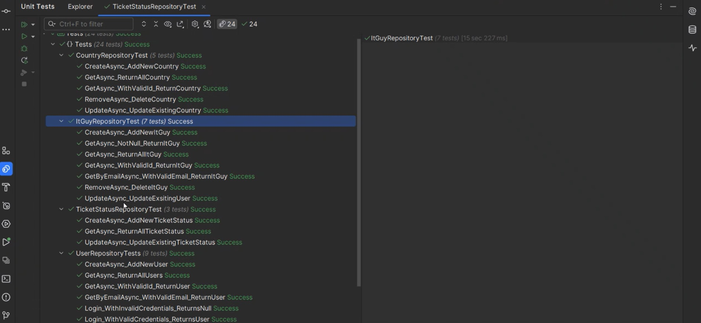
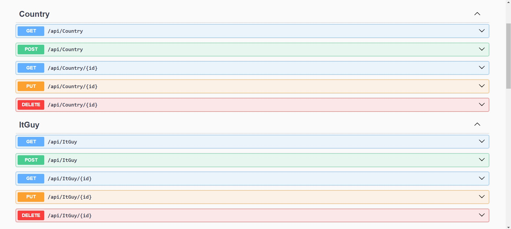
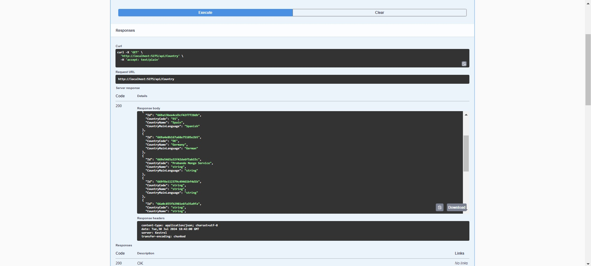

# Super Ticketing Backend

## Índice 📝

- [Descripción](#descripción-);
- [Developers](#developers-)
- [Enlace a los repositorios](#enlaces-a-los-repositorios-)
- [Tecnologías empleadas en el Backend](#tecnologías-empleadas-en-backend)
- [Instalación](#instalación-)
    - [Requisitos previos](#requisitos-previos)
    - [Instalación del proyecto](#instalación-del-proyecto)
- [Uso](#uso-)
- [Estructura del proyecto](#estructura-del-proyecto-)
- [Contribuición](#contribuición-)
- [Convenciones del proyecto](#Convención-de-codificación-en-Ticketing-Backend)
- [Distribución y seguimiento](#distribución-y-seguimiento-de-tareas-con-metodologías-ágiles-)
- [Despliegue del Proyecto](#despliegue-del-proyecto-)
- [Pendientes para futuros sprints](#pendientes-para-futuros-sprints)
- [Documentación del Código](#documentación-del-código)
- [Special thanks](#special-thanks-)

## Descripción 💡

Este proyecto tiene como objetivo desarrollar una aplicación web para monitorear y gestionar tickets, diseñada específicamente para el equipo de IT encargado del soporte técnico, proporcionando una solución eficiente y organizada.

- <b>Funcionalidades Principales:</b>
  Comunicación Directa entre Frontend y Backend: La aplicación estará diseñada con una arquitectura donde el frontend y el backend se comunican directamente. El frontend interactuará con el backend para la creación, visualización, actualización y eliminación de tickets sin depender de APIs externas.

- <b>CRUD Completo:</b> Implementará un sistema completo de operaciones CRUD (Crear, Leer, Actualizar, Eliminar) para gestionar tickets de soporte técnico. Los usuarios podrán crear nuevos tickets, visualizar y buscar tickets existentes, editar detalles de tickets y eliminar aquellos que ya no sean necesarios.
- <b>Frontend y Backend Independientes: </b>El proyecto contará con una interfaz de usuario intuitiva y fácil de usar, y un backend robusto que manejará la lógica del negocio y el almacenamiento de datos. Ambos componentes estarán diseñados para operar de manera eficiente y comunicarse eficazmente a través de métodos internos de interacción.

- <b>Tests Unitarios:</b>Se realizarán pruebas unitarias para asegurar la calidad y el correcto funcionamiento de la aplicación. Esto incluirá pruebas para verificar el desempeño y la integridad de los componentes tanto del frontend como del backend, garantizando que cada parte del sistema funcione correctamente.

<b>Objetivo del Proyecto:</b>
El objetivo de este proyecto es proporcionar al equipo de soporte técnico una herramienta web completa para la gestión eficiente de tickets. La aplicación permitirá una gestión centralizada y optimizada de los tickets de soporte, facilitando la resolución de problemas, mejorando la comunicación interna y acelerando el tiempo de respuesta. Al implementar esta solución, buscamos mejorar la eficiencia del equipo de soporte técnico y la satisfacción de los usuarios finales al proporcionar una plataforma organizada y accesible para el seguimiento y resolución de tickets.


## Developers 👩‍💻

[<br><sub>Alex Morell</sub>](https://github.com/alexmrtc) |  [<br><sub>Laura Benavides</sub>](https://github.com/LauraBenavides33) |  [<br><sub>Roger Esteve</sub>](https://github.com/alejandria1899) |
| :---: | :---: | :---: |
[<br><sub>Michely Paredes</sub>](https://github.com/Michely05) |  [<br><sub>Iván Vallejos</sub>](https://github.com/MegaDraconius) |  [<br><sub>Sara Jorja</sub>](https://github.com/SaraJoLo) |


## Enlaces a los repositorios 📦

Enlace al Repositorio del Frontend:
https://github.com/MegaDraconius/super-ticketing-frontend

Enlace al Repositorio del Backend:
https://github.com/MegaDraconius/super-ticketing-backend

## Tecnologías empleadas en Backend🔬


- IDE para el proyecto:

  - [](https://www.jetbrains.com/es-es/rider/)


- Tecnologías empleadas para el desarrollo de la base de datos:

    - [](https://dotnet.microsoft.com/es-es/)
    - [](https://dotnet.microsoft.com/es-es/languages/csharp)
    - [](https://www.mongodb.com/)

- Despliegue de la base de Datos:

    - [](https://www.mongodb.com/es/lp/cloud/atlas/try4?utm_source=google&utm_campaign=search_gs_pl_evergreen_atlas_core-high-int_prosp-brand_gic-null_emea-es_ps-all_desktop_eng_lead&utm_term=mongodb%20atlas&utm_medium=cpc_paid_search&utm_ad=e&utm_ad_campaign_id=19609093152&adgroup=145580477757&cq_cmp=19609093152&gad_source=1&gclid=CjwKCAjwnqK1BhBvEiwAi7o0Xzp5vGl1uUVwMswcgiTGWlWaFQMVZb5dfhEURMLDLNdjSc_Q6OpBhRoCDWcQAvD_BwE?utm_source=google&utm_campaign=search_gs_pl_evergreen_atlas_core-high-int_prosp-brand_gic-null_emea-es_ps-all_desktop_eng_lead&utm_term=mongodb%20atlas&utm_medium=cpc_paid_search&utm_ad=e&utm_ad_campaign_id=19609093152&adgroup=145580477757&cq_cmp=19609093152&gad_source=1&gclid=CjwKCAjwnqK1BhBvEiwAi7o0Xzp5vGl1uUVwMswcgiTGWlWaFQMVZb5dfhEURMLDLNdjSc_Q6OpBhRoCDWcQAvD_BwE)


- Tecnologías para realizar testing:

  - [](https://xunit.net/)


## Instalación 💾

### Requisitos previos

Instalar jetbrains:
- [JetBrains](https://www.jetbrains.com/es-es/rider/)

o en su defecto

Instalar Visual Studio:
- [Visual Studio](https://visualstudio.microsoft.com/es/)


### Instalación del proyecto

1. Clonar el repositorio:

```bash
 git clone https://github.com/MegaDraconius/super-ticketing-backend
```

2. Las dependencias se instalan automaticamante al realziar el clone del repositorio.
## Uso ⌨️

Para visualizar el proyecto en Local:

1. Ejecuta el servidor de desarrollo:

   ```bash
   dot net run
   ```
2. Ejemplo de vista una vez desplegado en local:


   

Para visualizar los test:

1. Ejecutar los test:

   ```bash
   dotnet test
   ```
   
   
## Estructura del proyecto 📐

```plaintext
/
└──  super-ticketing-backend
      ├── .git
      ├── .idea
      ├── super-ticketing-backend
      |     ├── bin
      |     ├── Controllers
      |     ├── DataBaseSettings
      |     ├── Dto's
      |     ├── Models
      |     ├── obj
      |     ├── Propierties
      |     ├── Repositories
      |     ├── Services
      |     ├── Utilities
      |     ├── appsettings.json
      |     ├── appsettings.Development.json
      |     ├── Program.cs
      |     ├── super-ticketing-backend.csproj
      |     └── super-ticketing-backend.http
      ├── test
      |     ├── automapperTests
      |     ├── RepositoryTests
      |     ├── bin
      |     ├── obj
      |     ├── MongoDbServiceTest.cs
      |     ├── Tests.csproj
      |     └──UnitTest1.cs
      ├── .gitignore
      ├── README.md
      ├── super-ticketing-backend.sln
      └── super-ticketing-backend.sln.DotSettings.user
  
       


```

- **_Controllers/:** Maneja las solicitudes HTTP, gestionando la lógica de la aplicación y devolviendo respuestas al cliente.

- **_DataBaseSettings/:** Configuración para la conexión y ajustes de la base de datos.

- **_Dto's/:** Data Transfer Objects utilizados para transferir datos entre el frontend y el backend.

- **_Models/:** Definiciones de entidades del dominio, representando la estructura de datos y reglas de negocio.

- **_Repositories/:** Interfaces y clases que gestionan el acceso a los datos y la interacción con la base de datos.

- **_Services/:** Implementa la lógica de negocio, procesando datos y aplicando reglas de negocio.

- **_Utilities/:** Funciones y clases auxiliares reutilizables en el proyecto.

- **_appsettings.json y appsettings.Development.json:** Archivos de configuración para ajustes en producción y desarrollo, respectivamente.

- **_Program.cs:** Configuración del host web y middleware para la aplicación.

- **_test/:** Contiene las pruebas automatizadas, incluyendo pruebas para repositorios y servicios.


## Contribuición 💻


1. Haz fork al repositorio.
2. Crea una nueva rama: `git checkout -b feature-name`.
3. Haz tus cambios.
4. Haz push de tu rama: `git push origin feature-name`.
5. Haz un pull request.

# Convención de codificación en Ticketing Backend

## Jet Brains: RIDER 🖥️

A la hora de crear código en nuestro editor de código tenemos  en cuenta los siguientes enunciados para un código legible, estructurado y ordenado tanto para los miembros del equipo como ojeadores del proyecto:

- Naming en inglés.

```c#
@page "/example"
@inject IJSRuntime JS

<h1 @ref="myHeading">Original Heading</h1>
```

- Usar Cammel Case. Ejemplo:

```c#
@page "/mycomponent"
@implements IAsyncDisposable

<h1 @ref="myHeading">Hello, world!</h1>
```

- Nombre de variables descriptivas y fáciles de leer.

```c#
public class MenuComponent : IOnInit
{
  private readonly IMenuService _menuService;
  public List<MenuItem> Menu { get; private set; }

  public MenuComponent(IMenuService menuService)
  {
    _menuService = menuService;
  }

  public void OnInit()
  {
    Menu = _menuService.GetMenu();
  }
}
```

- Los métodos o funciones deben tener nombres de verbos o frases verbales como ‘*menuService’, ‘deletePage’* o ‘*save*’.
- Las clases y objetos deben tener un nombre de un sustantivo o una frase nominal como *‘MenuComponent’, ‘IAsyncDisposable’, ‘Account’* o ‘*AddressParser*’.
- Evitar palabras como *‘Manager’, ‘Processor’, ‘Data’* o *‘Info’* en el nombre de la clase. Un nombre de clase no debería ser un verbo.


## Distribución y seguimiento de tareas con metodologías ágiles 👩‍💻

Para la gestión de nuestro proyecto, hemos utilizado Trello como nuestra herramienta principal, siguiendo la metodología Kanban para la distribución eficiente de tareas. Este enfoque nos ha permitido visualizar el flujo de trabajo, limitar la cantidad de trabajo en progreso y maximizar la eficiencia. Además, hemos seguido una serie de convenciones y mejores prácticas para garantizar la coherencia y la calidad en todo nuestro trabajo. Creemos que este enfoque estructurado y disciplinado ha sido fundamental para nuestro éxito hasta ahora y continuará guiándonos en nuestras futuras iniciativas

Incluyo un enlace a nuestro tablero de Trello para que puedan ver nuestra organización y gestión de tareas.[Trello Super Ticketing](https://trello.com/b/MYcpBsGx/super-ticketing)

##  Capturas de pantalla

Imágenes de los tests realizados y vistas previas con el visualizador Swagger:




## Despliegue del Proyecto 📽️

Hemos desplegado nuestra base de datos usando MongoDB Atlas que nos ofrece escalabilidad automática, gestión y mantenimiento simplificados, alta disponibilidad con replicación y recuperación ante desastres, seguridad avanzada con cifrado y control de acceso, monitoreo y alertas integradas, y fácil integración con otras herramientas en la nube. Estas características optimizan el despliegue y la administración de bases de datos en la nube.


- Enlace a la pagina de [Ticketing Backend](https://cloud.mongodb.com/v2/6697b290c7ed8c3f10eb19b9#/clusters)


## Pendientes para futuros Sprints

Reconocemos que nuestro proyecto actual tiene un gran potencial para crecer y evolucionar. Aunque hemos logrado mucho, sabemos que hay características adicionales que podríamos implementar para mejorar aún más nuestro producto. Estas mejoras no se han realizado hasta ahora debido a limitaciones de tiempo y conocimientos técnicos. Sin embargo, estamos comprometidos con la mejora continua y planeamos adquirir las habilidades necesarias para implementar estas características en el futuro.

- [ ] Añadir nuestra propia lógica para el login mediante conexión entre el frontend y backend.
- [ ] Añadir las funcionalidades para una implementación del historial.
- [ ] Depurar código siguiendo principios SOLID y CLEAN CODE.
- [ ] Realizar más pruebas unitarias y poder realizar test de integración.
- [ ] Realizar un despliegue en un servidor propio para la base de datos.

## Documentación del Código

El código se está documentando en un notion en el cual se detalla paso a paso lo siguientes puntos:

- Visión General del Código: Una descripción general de la arquitectura del proyecto y cómo se estructuran los diferentes componentes.
- Ejemplos de Código: Fragmentos de código que ilustran cómo se deben implementar y utilizar las funciones principales.
- Guía de Uso: Instrucciones paso a paso sobre cómo utilizar las principales funcionalidades del código.

## Special thanks 👥

- A nuestros compañeros, gracias por los momentos compartidos, por su dedicación y por el espíritu de equipo que nos llevó a superar cada desafío.

- A nuestros profesores, gracias por su guía, paciencia y sabiduría. Sin su apoyo, este proyecto no habría sido posible.
